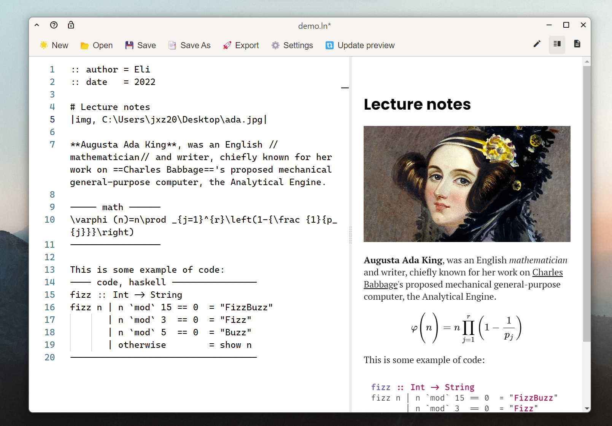

# Selma
Selma is simple text editor and note taking app that uses my own, human friendly, markup language [λnote](https://www.github.com/adelhult/lambda-note). This software is written in React and Rust and built on the Monaco editor (the same that VS Code uses).



## Installation
The project is very much a work in progress, however feel free to play around with it yourself.
Note that you are required to have both node and the rust toolchain installed. 
```
git clone https://github.com/adelhult/selma.git
cd selma
npm install
npm run tauri dev

or...
npm run tauri build
```

## TODOs
There are a lot of things that could be worked on, most notably, a complete rewrite of state
management (it is currently quite messy) and vault/workspace-like feature with a file tree.
But I intend to at least finish the following things:
- [ ] Fix suggestion duplicate bug
- [ ] Improve when suggestions appear
- [ ] Better settings menu
- [ ] Use the template translator on export
- [ ] Complete syntax highlighting
- [ ] Intro documentation about λnote
- [ ] Fix issues with relative file paths
